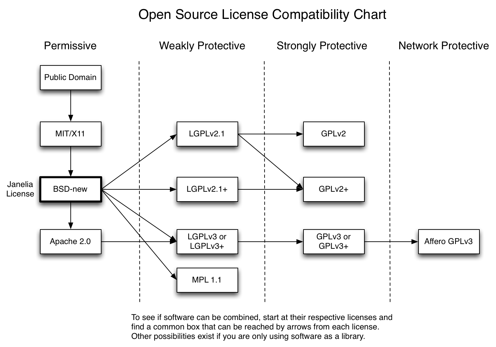

There are a large number of Free-Libre / Open Source Software (FLOSS) licenses, but only a few are widely used. The widely-used licenses tend to be compatible, i.e., the software can be combined to produce a larger work. The following figure shows how licenses can be combined:

 
In this figure, the boxes are the names of different FLOSS licenses. An arrow from box A to box B means that you can combine software with these licenses; the combined result effectively has the license of B, possibly with additions from A. To see if software can be combined, just start at their respective licenses, and find a common box you can reach following the arrows. For example, Apache 2.0-licensed software and GPLv2+-licensed software can both reach “GPLv3 or GPLv3+”, so they can be combined using GPLv3 or GPLv3+. This figure has been carefully crafted so following a path determines if two licenses are compatible.

At the left are the “permissive” licenses, which permit the software to become proprietary (i.e., not FLOSS). At the top left is “Public Domain”, which strictly speaking isn’t a license but in effect it works like one. You can do anything with public domain software, but it is rare; the software must be explicitly released to the public domain or be created by a U.S. Government employee in their official capacity. Next is the so-called “MIT” or “X11” license, which is very permissive (you can do just about anything except sue the author). Software under the MIT license is easily combined with the modern 3-clause Berkeley Software Distribution (BSD-new) license, which compared to the MIT license adds a clause forbidding the use of the author’s name to endorse or promote products without permission (it’s debatable if this clause actually does anything, since you typically have to have such permission anyway). Finally we have the Apache version 2.0 license.

Many of the [software packages used within FlyEM](/dependencies.html) have permissive licenses.  Packages like libjpeg, HDF5, freetype 2, libpng, and boost have their own licenses but are very similar to the BSD license and can be grouped in that category.

At the right are the “strongly protective” (“strong copyleft”) licenses, which prevent the software from becoming proprietary. This includes the most popular FLOSS license, the GNU General Public License (GPL). The GPL has a version 2 (GPLv2) and 3 (GPLv3); a “+” afterwards means “version X or later”. GPLv2-only cannot be combined with the network-protective Affero GPLv3, but GPLv2+ (“version 2 or later”) can via GPLv3.

In the middle are the “weakly protective” (“weak copyleft”) licenses, a compromise between permissive and strongly protective licenses. These prevent the software component (often a software library) from becoming proprietary, yet permit it to be part of a larger proprietary program. This figure shows the rules when you are making other software part of the weakly protected component; there are other possibilities if you are only using the component as a library. The GNU Lesser General Public License (LGPL) is the most popular weakly protective license, and has a version 2.1 (LGPLv2.1) and 3 (LGPLv3). Note that LGPLv2.1 gives you permission to relicense the code under any version of the GPL since GPLv2. Another such license is the Mozilla Public License 1.1 (MPL 1.1), but the MPL has the serious drawback of being incompatible with the widely-popular GPL; you can’t even use an MPL module in a larger GPL’ed program.

Note that this page provides a simple way of looking at licensing issues but should not be considered legal advice.  Individual licenses should be read and proper legal counsel should be consulted as needed.

This page was derived from the [excellent work of David Wheeler](http://www.dwheeler.com/essays/floss-license-slide.html) and can be modified according to the following license:

 
This work is licensed under a <a rel="license" href="http://creativecommons.org/licenses/by-sa/3.0/">Creative Commons Attribution-ShareAlike 3.0 Unported License</a>.
